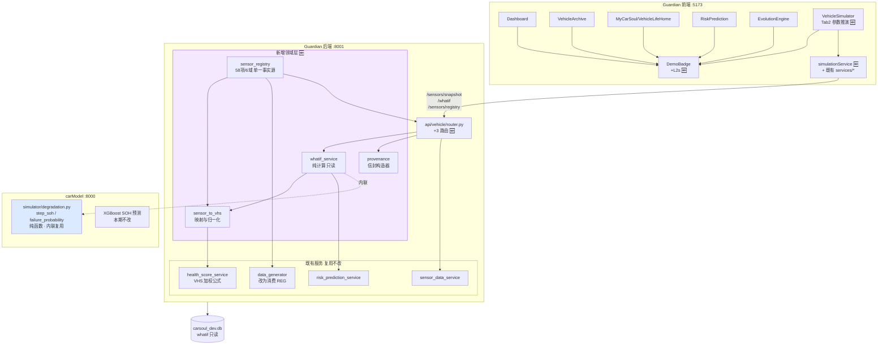

# 车辆数据模拟与来源标识 — 架构设计方案

> 版本 v1.0 · 状态：**待评审（未冻结）** · 作者：蓝思图（产品架构）
> 适用系统：Guardian 前端 `:5173` / Guardian 后端 `:8001` / carModel 预测引擎 `:8000`

---

## 0. 执行摘要（先看这段）

本次调研后，**原始需求中的三条假设有两条与代码现状不符**，方案已据实修正。请主理人优先确认本节 4 个结论，再看后文细节。

| # | 原始任务假设 | 代码现状（已核实） | 方案处置 |
|---|---|---|---|
| 1 | 新增组件 `<DataSourceBadge mode="sim"｜"real">` | **已存在 `components/DemoBadge.tsx`**，L0/L1/L2/L2b/L3 五级分级，带 GOAI 红线2 合规约束与"双向失真"规则 | **不新建组件**。复用 DemoBadge，新增一个 `L2s` 等级 + 后端 provenance 驱动。二值 `sim｜real` 是相对现有五级模型的**信息降级**，会引发反向失真违规 |
| 2 | 新增 `POST /api/vehicle/{id}/simulate` 做 what-if（不写库） | **该路径已被占用**：`router.py:980` 的 `simulate_vehicle` 是**写库**的数据生成器（写 sensor/trip/fault + 刷新 digital_state） | **必须换路径**。what-if 使用 `POST /api/vehicle/{id}/whatif`。若复用原路径将破坏既有生成器契约 |
| 3 | 新增全车传感器数据模型 | **已存在** `models/sensor_data.py`（`VehicleSensorData`）+ `sensor_data_service` + 5 个 `/sensors/*` 路由；`data_generator` 已定义 12 项 EV 传感器 | **不新建表**。以"传感器注册表（Sensor Registry）"扩展既有扁平模型，12 项 → 58 项，6 个域 |
| 4 | 健康分/风险联动需新写算法 | **已存在** `health_score_service`（VHS 加权公式）、`risk_prediction_service`；carModel 侧 `simulator/degradation.py` 有**因果退化引擎**（`step_soh` / `failure_probability`） | **不新写算法**。what-if 复用既有 VHS 公式 + carModel 因果引擎，仅新增"纯函数化"改造 |

**一句话结论**：这不是一个"从 0 建三个模块"的需求，而是一个 **"对齐既有资产 + 补三块缺口"** 的需求。缺口是：(a) provenance 的后端统一契约，(b) 传感器域从 12 项扩到 58 项，(c) what-if 只读推演链路。

---

## 1. 需求清单与边界

### 1.1 需求清单

| ID | 需求描述 | 优先级 | 边界类别 | 理由 | 验收标准 |
|---|---|---|---|---|---|
| R-01 | 后端统一返回 `provenance` 数据来源信封 | P0 | In | 前端无法自行判定数据真伪，必须由数据产生方声明 | 5 类核心接口 100% 带 `provenance`，字段通过 schema 校验 |
| R-02 | DemoBadge 扩展 `L2s`（假设推演）等级 | P0 | In | what-if 结果语义既非 L1 预测也非 L3 纯前端，无对应等级 | `L2s` 渲染紫色角标，文案含"假设推演·非实测" |
| R-03 | 各页面角标改为 provenance 驱动，禁止硬编码 | P0 | In | 遵循既有 BC-20 约定（TimelineDemo 已示范） | 5 个目标页面无硬编码 `level=` 字面量（TimelineDemo 模式） |
| R-04 | 传感器注册表（58 项 / 6 域）单一事实源 | P0 | In | 生成器、面板、校验三方需共用同一份口径 | 注册表可被后端生成器与前端面板同时消费，无第二份定义 |
| R-05 | `GET /sensors/snapshot` 全车快照接口 | P0 | In | 面板需一次拿到全域当前值，现有 `/sensors` 是扁平时序 | 单次请求返回 6 域全字段，P95 < 300ms |
| R-06 | `POST /whatif` 只读推演接口 | P0 | In | 面板核心能力 | 不产生任何 DB 写入（以写计数断言）；返回健康分/告警/风险/SOH 曲线 |
| R-07 | 模拟控制面板改造（VehicleSimulator 页） | P0 | In | 需求 3 的载体 | 左调参右反馈，参数变更 500ms 内出反馈 |
| R-08 | what-if 结果可"另存为情景"对比 | P2 | Deferred | 依赖 R-06 稳定后再做，非首期必需 | — |
| R-09 | 真实车辆 OBD/TSP 实时接入 | — | Out | 无真实车源与 TSP 授权 | — |
| R-10 | 传感器数据高频入库（>1Hz） | — | Out | dev 环境为 SQLite，无 TimescaleDB | — |
| R-11 | what-if 结果反写车辆档案 | — | Out | 与"只读推演"设计原则冲突，且会污染演示数据 | — |
| R-12 | 车端/端侧部署与算力评估 | — | Out | 本需求纯云侧前后端，不涉及车端 | — |

### 1.2 范围边界声明

**In-Scope（本期做）**
1. 后端 provenance 信封契约 + 5 类接口改造（R-01）
2. DemoBadge `L2s` 等级扩展 + 5 页面接入（R-02/R-03）
3. 传感器注册表 58 项 6 域定义 + 生成器扩展（R-04）
4. `/sensors/snapshot` 与 `/whatif` 两个新接口（R-05/R-06）
5. VehicleSimulator 页改造为调参面板（R-07）

**Out-of-Scope（本期明确不做）**
1. **真实车辆数据接入**（OBD dongle / TSP / T-Box）——无车源、无授权，且一旦接入即触发个人信息与位置数据合规义务。解锁条件：拿到真实车源 + 法务出具数据处理路径结论。
2. **高频时序入库**（>1Hz 持久化）——dev 为 SQLite，`vehicle_sensor_data` 无 hypertable。解锁条件：生产切 TimescaleDB 并完成分区策略。
3. **what-if 结果写库/反写档案**——违反只读推演原则，会污染 demo 车"小白"的既有数据链。永久不做（除非改为显式"情景快照"独立表，即 R-08）。
4. **车端/端侧推理与算力评估**——本需求全在云侧。
5. **carModel `:8000` 的模型重训练/换基座**——本期只调用，不改模型。
6. **多车/车队级模拟**——`simulator/fleet.py` 虽存在，但本期面板锁定单车。

**Deferred（暂不做，留钩子）**
1. R-08 情景另存与 A/B 对比——`/whatif` 响应预留 `scenario_id` 字段（本期恒为 `null`）
2. 传感器异常注入模板库（"一键制造电池热失控"）——注册表预留 `fault_injection` 段
3. WebSocket 实时推流——本期用请求-响应 + 前端防抖，接口形态兼容后续升级

---

## 2. 模块一：数据来源标识机制

### 2.1 现状与问题

现状已有相当成熟的资产，**必须在其上演进而非替换**：

- `components/DemoBadge.tsx`：五级分级 `L0 | L1 | L2 | L2b | L3`，双维度（`level` 分级 + `visible` 显隐）
- 组件头部注释明确写有合规约束：**"双向失真都是违规"**
  - 正向失真：用模拟数据却不标注 → 把假的说成真的
  - 反向失真：用真实接口数据却挂角标 → 把真的说成假的
  - 故 `level="L0"` 时组件**恒返回 null**
- `TimelineDemo.tsx:144-146` 已示范正确用法，并留有约定 **BC-20：角标分级由后端 `data.demo_mode` 驱动，禁止硬编码 level**

**问题**：BC-20 只在 TimelineDemo 一个页面落实。其余页面（EvolutionEngine、StoryMode、MemoryOcean、VehicleSimulator）仍是 `<DemoBadge level="L3" visible />` **硬编码**。Dashboard 用 `usingDemo` 局部状态驱动，口径与 TimelineDemo 不统一。

> ⚠️ 因此本模块的真实目标不是"加一个角标"，而是**把 BC-20 从 1 个页面推广到 5 个页面，并给它一个后端契约支撑**。

### 2.2 关键决策：provenance 机制选型

三个候选方案加权对比（评分 1–10，越高越好）：

| 维度 | 权重 | A. `VITE_DATA_MODE` 构建期环境变量 | B. 后端响应 provenance 信封 | C. 前端逐页硬编码（现状） |
|---|---|---|---|---|
| 防双向失真 | 0.30 | 3 — 全局一刀切，真实接口也会被标 sim，**直接触发反向失真红线** | 9 — 数据产生方自证，粒度到单次响应 | 4 — 人工维护，易漏改、易过期 |
| 粒度准确性 | 0.25 | 2 — 只有 app 级，同页混合真/假数据无法表达 | 9 — 可到字段级（`field_overrides`） | 6 — 页面级 |
| 合规可审计 | 0.20 | 4 — 无运行时留痕 | 9 — 响应体即证据，可被审计日志采集 | 3 — 无凭据 |
| 改造成本 | 0.15 | 9 — 一行 env | 5 — 需改 5 类接口 + schema | 8 — 已有 |
| 维护成本 | 0.10 | 7 | 8 — 新接口自动继承 | 3 — 每加一页要记得挂 |
| **加权总分** | | **4.25** | **8.30** | **4.80** |

**结论：采用 B（后端 provenance 信封），A 降级为仅供演示环境的强制覆盖开关，C 淘汰。**

**为什么不是 A？** `VITE_DATA_MODE` 是**构建期常量**，一旦设为 `sim`，Dashboard 上那些**真实来自 XGBoost 推理的 SOH 数值也会被打上"模拟"角标**——这正是 DemoBadge 注释里明令禁止的反向失真。且同一页面常混合三类数据（seed 档案 + 真实模型预测 + 前端回落），单一全局 flag 无法表达。它唯一的合理用途是"对外演示时强制全站降级标注"，故保留为 `VITE_DATA_MODE_OVERRIDE`，默认空。

**为什么不是 C？** 硬编码在只有 5 个页面时尚可维护，但它把"这份数据是不是真的"这一**事实判断**交给了前端开发者的记忆，无运行时凭据、不可审计。EvolutionEngine 已经出现 `level="L3"` 硬编码——一旦后续接了真后端，角标不会自动消失，立刻变成反向失真。

### 2.3 provenance 信封契约

所有涉及车辆数据的响应，在顶层附加 `provenance` 对象：

```jsonc
{
  "...": "业务字段原样不动（向后兼容，不破坏既有前端）",
  "provenance": {
    "data_source": "seed",              // 见下表枚举
    "demo_mode": true,                   // 兼容既有 TimelineDemo 字段语义
    "badge_level": "L2b",               // 后端直接给出建议等级，前端不再推断
    "origin": "seed:init_db",           // 可读来源，如 seed:init_db / carModel:xgb-soh-v1.2 / whatif:engine-v1
    "as_of": "2026-08-10T05:00:00Z",    // 数据观测/生成时刻
    "field_overrides": {                 // 可选：同一响应中个别字段来源不同
      "predicted_soh": "L1"
    }
  }
}
```

`data_source` 枚举 → `badge_level` 映射（**后端唯一裁定，前端不得自行推断**）：

| `data_source` | 含义 | `badge_level` | 角标表现 |
|---|---|---|---|
| `live` | 真实车辆/真实接口实测数据 | `L0` | 不渲染（反向失真红线） |
| `predicted` | 真实模型对真实输入的概率性推断 | `L1` | 金色「预测标注 · 模型输出」 |
| `fallback` | 后端不可达，前端回落 demoData | `L2` | 蓝色「演示回落 · 后端未连通」 |
| `seed` | 后端 `init_db` 注入的持久虚构车 | `L2b` | 橙色「持久虚构车 · 演示数据」 |
| `whatif` | **真实引擎 + 用户假设输入** | `L2s` **（新增）** | 紫色「假设推演 · 非实测」 |
| `mock` | 无后端，纯前端动画/占位 | `L3` | 红色「演示模式 · 模拟数据」 |

### 2.4 新增 `L2s` 等级的必要性论证

`L2s` 不能被折叠进任何现有等级，因为它的**输入是假的、引擎是真的**，这是既有五级都没覆盖的组合：

- **不能用 L1**：L1 语义是"真实输入 + 模型概率输出"，其数值对真实车辆有参考意义。L2s 的输入是用户随手拖的滑块，对真实车辆**没有任何参考意义**，混用会让用户误信推演结论。
- **不能用 L3**：L3 语义是"无后端、纯前端动画"，暗示"这数字是编的"。但 L2s 的计算过程是**真实的 VHS 公式 + 真实的因果退化引擎**，把它说成"编的"低估了其工程价值，也是一种失真。
- **不能用 L2b**：L2b 是"后端恒定虚构车"，是**静态**的；L2s 是用户**动态**构造的假设，每次不同。

组件改动（仅新增一个 map 条目，**不改动任何既有逻辑**）：

```tsx
export type DemoLevel = "L0" | "L1" | "L2" | "L2b" | "L2s" | "L3";

L2s: {
  color: "purple",
  text: "假设推演 · 非实测",
  tooltip: "本结果由真实健康分模型与因果退化引擎计算，但输入参数为用户手动假设值，"
         + "不代表该车辆的真实状态，不可作为检修依据。",
  icon: <ExperimentOutlined />,
},
```

### 2.5 页面接入清单

| 页面 | 路由 | 当前写法 | 改造后 | 主要 `data_source` |
|---|---|---|---|---|
| Dashboard | `/dashboard` | `level="L2" visible={usingDemo}` | provenance 驱动 | `seed`（后端通）/ `fallback`（不通） |
| 车辆档案 VehicleArchive | `/archive` | **无角标** ⚠️ | 新增，provenance 驱动 | `seed` → `L2b` |
| 数字生命 MyCarSoul / VehicleLifeHome | `/soul`,`/life` | 仅注释占位 | 新增，provenance 驱动 | `seed` → `L2b` |
| 风险预测 RiskPrediction | `/risk` | **无角标** ⚠️ | 新增，双层：页面 `L2b` + 预测卡 `L1` | `seed` + `predicted` |
| 进化引擎 EvolutionEngine | `/evolution` | `level="L3"` 硬编码 | provenance 驱动 | 接后端前 `mock`→`L3` |
| **模拟面板 VehicleSimulator** | `/simulator` | `level="L3"` 硬编码 | provenance 驱动 | `whatif` → **`L2s`** |
| TimelineDemo | `/timeline` | ✅ 已合规 | 保持，仅补 `badge_level` | `seed` → `L2b` |
| StoryMode / MemoryOcean | `/story`,`/memory` | `level="L3"` | 保持 L3（确无后端） | `mock` |

> ⚠️ **重点风险**：车辆档案与风险预测两页当前**完全没有角标**，但展示的是 seed 虚构车"小白"的数据——这是现存的**正向失真**（把假的当真的展示），属于 GOAI 红线2 违规。建议此两页优先级提到 P0 最前。

---

## 3. 模块二：全车传感器数据域模型

### 3.1 设计原则

1. **不新建表**。既有 `VehicleSensorData`（`vehicle_id / sensor_type / sensor_value / unit / meta{} / created_at`）是扁平 EAV 时序结构，足以承载全部 58 项信号。新建强类型宽表会与 `sensor_data_service`、`/sensors/*` 五个路由全部冲突。
2. **引入传感器注册表（Sensor Registry）作为单一事实源**。当前 `data_generator.py:27-55` 的 `_FUEL_SENSORS` / `_ELECTRIC_SENSORS` 元组列表是**事实上的注册表，但只服务于生成器**。将其提升为独立模块 `app/domain/sensor_registry.py`，同时被生成器、快照接口、what-if 校验、前端面板四方消费。
3. **三层采样分级**。CAN 原生频率 ≠ 上云频率 ≠ 入库频率。SQLite 环境下必须显式区分，否则会有人试图把 100Hz 扭矩写进库。
4. **物理合理性优先于数值好看**。范围取自量产 EV 常见标定区间；`warn/crit` 阈值与既有 `_FUEL_SENSORS` 的 `low_alert/high_alert` 语义对齐。

### 3.2 采样分级定义

| 层 | 标识 | 含义 | 本期落地 |
|---|---|---|---|
| L_can | CAN 原生 | 总线上的真实报文频率 | **仅注册表标注，不实现** |
| L_up | 上云 | T-Box 聚合后上报频率 | 注册表标注，what-if 按此口径 |
| L_db | 入库 | 实际持久化频率 | **≤ 1/60 Hz**（SQLite 硬约束，见 Out-of-Scope #2） |

### 3.3 传感器域定义表

图例：`✅` = 既有（`data_generator` 已产出）；`🆕` = 本期新增。共 **58 项 / 6 域**（既有 12 项全部保留，字段名不变，保证向后兼容）。

#### 域 1 · 电池系统 `battery`（16 项）— VHS 权重 0.25

| 状态 | 字段 `sensor_type` | 单位 | 正常范围 | warn | crit | L_can | L_up | 说明 |
|---|---|---|---|---|---|---|---|---|
| ✅ | `battery_voltage` | V | 320–420 | <340 / >415 | <320 / >420 | 10Hz | 1Hz | 动力电池包总压 |
| 🆕 | `battery_current` | A | -200–400 | >350 | >400 | 10Hz | 1Hz | 正放电/负回充 |
| ✅ | `battery_level` | % | 0–100 | <15 | <5 | 1Hz | 0.2Hz | SOC |
| 🆕 | `battery_soh` | % | 70–100 | <85 | <75 | 0.01Hz | 1/h | **健康度，what-if 主控参数** |
| ✅ | `battery_temp` | ℃ | 0–50 | >45 | >55 | 1Hz | 0.2Hz | 包体平均温 |
| 🆕 | `cell_voltage_min` | V | 3.0–4.2 | <3.2 | <2.9 | 10Hz | 1Hz | 单体最低压 |
| 🆕 | `cell_voltage_max` | V | 3.0–4.25 | >4.20 | >4.30 | 10Hz | 1Hz | 单体最高压 |
| 🆕 | `cell_voltage_delta` | mV | 5–60 | >80 | >150 | 10Hz | 1Hz | **一致性偏差，直连 `failure_probability`** |
| 🆕 | `cell_temp_min` | ℃ | 0–45 | <-5 | <-15 | 1Hz | 0.2Hz | — |
| 🆕 | `cell_temp_max` | ℃ | 0–50 | >48 | >58 | 1Hz | 0.2Hz | 热失控前兆 |
| 🆕 | `cell_temp_delta` | ℃ | 0–8 | >10 | >15 | 1Hz | 0.2Hz | 温度一致性 |
| 🆕 | `internal_resistance` | mΩ | 0.8–3.0 | >2.5 | >4.0 | 0.01Hz | 1/h | 随老化上升 |
| 🆕 | `insulation_resistance` | MΩ | 0.5–100 | <1.0 | <0.5 | 0.1Hz | 0.1Hz | **安全硬指标，国标 ≥500Ω/V** |
| 🆕 | `charge_cycles` | 次 | 0–3000 | >1500 | >2500 | 事件 | 事件 | 累计等效循环 |
| 🆕 | `fast_charge_ratio` | 比例 | 0–1 | >0.6 | >0.8 | — | 1/d | **快充占比，退化引擎入参** |
| 🆕 | `battery_power` | kW | -80–250 | >200 | >240 | 10Hz | 1Hz | 瞬时功率 |

#### 域 2 · 电机 / 驱动 `motor`（9 项）— VHS 权重 0.30（映射 engine）

| 状态 | 字段 | 单位 | 正常范围 | warn | crit | L_can | L_up | 说明 |
|---|---|---|---|---|---|---|---|---|
| 🆕 | `motor_rpm` | rpm | 0–16000 | >14000 | >15500 | 100Hz | 10Hz | 转速 |
| 🆕 | `motor_torque` | N·m | -400–450 | >420 | >450 | 100Hz | 10Hz | 输出扭矩 |
| ✅ | `motor_temp` | ℃ | 0–120 | >110 | >130 | 10Hz | 1Hz | 定子绕组温度 |
| 🆕 | `motor_rotor_temp` | ℃ | 0–140 | >130 | >150 | 1Hz | 0.2Hz | 转子（磁钢退磁风险） |
| 🆕 | `inverter_temp` | ℃ | 0–95 | >85 | >100 | 10Hz | 1Hz | IGBT/SiC 结温 |
| 🆕 | `motor_efficiency` | % | 85–97 | <88 | <82 | 1Hz | 0.2Hz | 效率 |
| 🆕 | `motor_phase_current_imbalance` | % | 0–3 | >5 | >10 | 10Hz | 1Hz | 三相不平衡 → 绕组故障 |
| ✅ | `power_draw` | kW | 0–150 | >140 | >150 | 10Hz | 1Hz | 整车功耗 |
| ✅ | `regen_brake` | kW | 0–50 | — | — | 10Hz | 1Hz | 动能回收 |

#### 域 3 · 底盘 / 制动 / 轮胎 `chassis`（14 项）— VHS 权重 0.15

| 状态 | 字段 | 单位 | 正常范围 | warn | crit | L_can | L_up | 说明 |
|---|---|---|---|---|---|---|---|---|
| ✅ | `tire_pressure_fl` `_fr` `_rl` `_rr` | bar | 2.2–2.8 | <2.0 / >3.0 | <1.8 / >3.2 | 0.1Hz | 0.02Hz | TPMS ×4（既有） |
| 🆕 | `tire_temp_fl` `_fr` `_rl` `_rr` | ℃ | 10–65 | >75 | >90 | 0.1Hz | 0.02Hz | 胎温 ×4 |
| 🆕 | `brake_pad_wear_front` | % | 0–100 | >70 | >85 | 事件 | 1/trip | 前制动片磨损率 |
| 🆕 | `brake_pad_wear_rear` | % | 0–100 | >70 | >85 | 事件 | 1/trip | 后制动片磨损率 |
| 🆕 | `brake_fluid_level` | % | 60–100 | <50 | <30 | 1Hz | 0.2Hz | 制动液位 |
| 🆕 | `suspension_travel_var` | mm | 0–40 | >55 | >70 | 10Hz | 1Hz | 悬架行程方差 → 减振器衰减 |
| 🆕 | `steering_angle` | ° | -540–540 | — | — | 100Hz | 10Hz | 方向盘转角 |
| 🆕 | `wheel_speed_delta` | km/h | 0–2 | >4 | >8 | 100Hz | 10Hz | 轮速差 → ABS/打滑 |

> 说明：胎压 4 项沿用既有 `tire_pressure_*` 命名，**不改为 `meta.position` 形式**——虽然 `VehicleSensorData.meta` 支持 `{"position":"FL"}`，但 `data_generator.py:112` 与前端 `VehicleSimulator` 的 `PARTS` 匹配逻辑均依赖 `startswith("tire_pressure")`，改造会引发回归。新增的胎温沿用同一后缀约定保持一致。

#### 域 4 · 热管理 `thermal`（7 项）

| 状态 | 字段 | 单位 | 正常范围 | warn | crit | L_can | L_up | 说明 |
|---|---|---|---|---|---|---|---|---|
| 🆕 | `coolant_temp_inlet` | ℃ | 15–45 | >50 | >60 | 1Hz | 0.2Hz | 电池冷却入口 |
| 🆕 | `coolant_temp_outlet` | ℃ | 18–50 | >55 | >65 | 1Hz | 0.2Hz | 出口 |
| 🆕 | `coolant_flow_rate` | L/min | 5–20 | <4 | <2 | 1Hz | 0.2Hz | 流量，堵塞检测 |
| 🆕 | `compressor_power` | kW | 0–6 | >5.5 | >6.5 | 1Hz | 0.2Hz | 压缩机功耗 |
| 🆕 | `heat_pump_mode` | 枚举 | 0=off 1=cool 2=heat 3=defrost | — | — | 0.1Hz | 0.1Hz | 数值型编码 |
| 🆕 | `chiller_active` | 布尔 | 0/1 | — | — | 0.1Hz | 0.1Hz | 电池主动冷却 |
| ✅ | `cabin_temp` | ℃ | 0–40 | — | — | 0.1Hz | 0.1Hz | 座舱温度 |

#### 域 5 · 环境 / 定位 `environment`（7 项）

| 状态 | 字段 | 单位 | 正常范围 | warn | crit | L_can | L_up | 说明 |
|---|---|---|---|---|---|---|---|---|
| ✅ | `speed` | km/h | 0–200 | >120 | >160 | 10Hz | 1Hz | 车速 |
| 🆕 | `gps_latitude` | ° | -90–90 | — | — | 1Hz | 0.1Hz | ⚠️ **合规敏感，见 §6** |
| 🆕 | `gps_longitude` | ° | -180–180 | — | — | 1Hz | 0.1Hz | ⚠️ **合规敏感** |
| 🆕 | `gps_altitude` | m | -100–5500 | — | — | 1Hz | 0.1Hz | 海拔（影响热管理） |
| 🆕 | `heading` | ° | 0–360 | — | — | 1Hz | 0.1Hz | 航向 |
| 🆕 | `ambient_temp` | ℃ | -40–55 | <-25 / >45 | <-35 / >50 | 0.1Hz | 0.1Hz | **环温，退化引擎入参** |
| 🆕 | `ambient_humidity` | % | 0–100 | >90 | — | 0.1Hz | 0.1Hz | 湿度（绝缘相关） |

#### 域 6 · CAN 总线 / 网络健康 `can_bus`（5 项）

| 状态 | 字段 | 单位 | 正常范围 | warn | crit | L_can | L_up | 说明 |
|---|---|---|---|---|---|---|---|---|
| 🆕 | `can_bus_load` | % | 10–60 | >75 | >90 | 1Hz | 0.2Hz | 总线负载率 |
| 🆕 | `can_error_frames` | 帧/min | 0–5 | >20 | >100 | 1Hz | 0.2Hz | 错误帧计数 |
| 🆕 | `can_node_timeouts` | 次/min | 0–1 | >3 | >10 | 1Hz | 0.2Hz | 节点掉线 |
| 🆕 | `dtc_active_count` | 个 | 0–3 | >5 | >10 | 事件 | 事件 | 活跃故障码数 |
| 🆕 | `gateway_latency` | ms | 1–20 | >50 | >120 | 1Hz | 0.2Hz | 网关转发时延 |

**统计**：既有 ✅ 12 项 → 全部保留且字段名不变；新增 🆕 46 项；**合计 58 项 / 6 域**。

### 3.4 与健康分 / 故障 / 风险的联动

既有 `health_score_service.py` 的 VHS 加权公式（**不修改**）：

```
VHS = 0.30·Engine + 0.25·Battery + 0.15·Chassis + 0.15·Driving + 0.15·Maintenance
分级：≥95 黄金车况 | ≥80 优秀 | ≥60 一般 | <60 风险车辆
```

本期要补的是**「58 项传感器 → 5 个 VHS 分项」的映射层**（新模块 `app/domain/sensor_to_vhs.py`）：

| VHS 分项 | 权重 | 输入传感器（含域内权重） | 归一化方式 |
|---|---|---|---|
| Engine | 0.30 | `motor_temp`(.30) `inverter_temp`(.25) `motor_efficiency`(.20) `motor_phase_current_imbalance`(.15) `motor_rotor_temp`(.10) | 偏离正常区间的**分段线性**扣分，crit 处扣满 |
| Battery | 0.25 | `battery_soh`(.40) `cell_voltage_delta`(.20) `cell_temp_max`(.15) `insulation_resistance`(.15) `internal_resistance`(.10) | SOH 直接线性映射；其余分段扣分 |
| Chassis | 0.15 | 胎压 ×4 偏差(.30) `brake_pad_wear_*`(.30) `suspension_travel_var`(.20) `tire_temp_*`(.10) `brake_fluid_level`(.10) | 对称偏差（过高过低同扣） |
| Driving | 0.15 | 面板"驾驶风格"参数（急加速/急刹/超速次数） | 沿用既有 `driving_behavior` 的 `safety_score` 口径 |
| Maintenance | 0.15 | 距上次保养天数 / 里程 | 沿用既有 `maintenance_service` 逻辑 |

**故障与风险联动的三条链路：**

1. **阈值告警链**：任一传感器越 `warn`/`crit` → 生成 `Alert`（category 复用既有 `engine/battery/brake/tire/body/electron` slug，保证前端 `VehicleSimulator.PARTS.alertKeys` 匹配不变）。crit 同时生成 `FaultLog`（DTC 码取自 `_FAULT_TEMPLATES`）。
2. **因果退化链**：复用 carModel `simulator/degradation.py` 的 `step_soh(soh, delta_cycles, cell_temp, fast_ratio, maintenance)` — 面板参数 `battery_soh` / `cell_temp_max` / `fast_charge_ratio` / `charge_cycles` 直接作为入参，前推 90 天得到 **SOH 衰减曲线**（含膝点加速效应）。
3. **失效概率链**：`failure_probability(soh, cell_balance_dev)` — 入参取 `battery_soh` 与 `cell_voltage_delta`（mV → 归一化），输出日故障概率，供风险预测卡展示。

> 🔑 **架构要点**：链路 2/3 的算法**已在 carModel 侧存在且为纯函数**（无 DB 依赖、`@dataclass(frozen=True)` 参数）。因此 what-if 可以**零副作用**复用。这是本方案能满足"不写库"原则的技术前提。
>
> 落地二选一（建议 A）：
> - **A. 代码内联**（推荐）：把 `degradation.py` 复制/发布为共享纯函数模块进 Guardian 后端。理由：单次 what-if 需前推 90 步，跨进程 HTTP 调用 90 次或传大数组，时延不可控；且该文件仅 94 行、无外部依赖。
> - B. HTTP 调 carModel `:8000`：耦合低但引入网络依赖，面板实时性（目标 <500ms）有风险，且 `:8000` 挂掉会导致面板整体不可用。

---

## 4. 模块三：车辆数据模拟控制面板

### 4.1 现状：`/simulator` 页已存在但语义不同

`pages/VehicleSimulator.tsx`（610 行）当前是一个**剖视图 + 闭环追溯动画**页：`Phase = "idle"|"detect"|"guard"|"recovered"`，6 个零件（`PARTS`）SVG 定位标注，配 `ClosedLoopTrace` 组件，挂 `<DemoBadge level="L3" visible />`。

它**不是**调参面板，但它的资产可复用：
- `PARTS[]` 的 6 子系统定义与 `alertKeys`/`schedKeys` 匹配规则 → 直接复用为反馈区的子系统分组
- `scoreColor()` / `scoreLevel()` 配色阈值（85/60）→ 复用
- SVG 剖视图 → 复用为面板中部"车辆状态热力图"，按子系统健康分着色

**决策：改造而非新建页**。新建 `/sim-lab` 会造成两个语义重叠的模拟页，用户困惑。改造后 `/simulator` 变为 Tab 结构：`Tab1 闭环演示`（原内容原样保留）+ `Tab2 参数推演`（新增）。

### 4.2 面板布局

```
┌──────────────────────────────────────────────────────────────────────┐
│  车辆数据模拟   [小白 Tesla Model Y ▾]   🟣假设推演·非实测   [重置][快照]│
│  Tab: ( 闭环演示 ) ( ●参数推演 )                                       │
├───────────────────────────┬──────────────────────────────────────────┤
│ ◀ 参数调节区 (38%)         │  实时反馈区 (62%)  ▶                      │
│                            │                                          │
│ 🔋 电池系统        [16] ▾  │  ┌── 综合健康分 VHS ──────────────────┐  │
│  SOH        ▓▓▓▓▓░ 92.0 % │  │      ⭕ 87.3  优秀   ▼ -4.2         │  │
│  单体压差   ▓▓░░░░ 35  mV │  │  Engine 91 │Battery 84│Chassis 88   │  │
│  最高单体温 ▓▓▓░░░ 38  ℃  │  │  Driving 90│Maint. 79 │(权重条形图) │  │
│  绝缘电阻   ▓▓▓▓▓░ 12  MΩ │  └────────────────────────────────────┘  │
│  内阻       ▓▓░░░░ 1.4 mΩ │  ┌── 预警列表 ────────────────────────┐  │
│  快充占比   ▓▓▓░░░ 0.35   │  │ 🔴 crit 单体压差 150mV 超限         │  │
│  ...(展开全部)             │  │ 🟠 warn 电池最高温 48℃ 接近阈值     │  │
│                            │  │ 🟡 info 距下次保养 800km            │  │
│ ⚙️ 电机系统        [9]  ▸  │  └────────────────────────────────────┘  │
│ 🛞 底盘制动        [14] ▸  │  ┌── SOH 90天衰减推演 ────────────────┐  │
│ 🌡️ 热管理          [7]  ▸  │  │  ╲___                              │  │
│ 🌍 环境定位        [7]  ▸  │  │      ╲╲__ 基线   ╲╲╲ 当前假设       │  │
│ 🔌 CAN 总线        [5]  ▸  │  │  (双线对比 + 膝点标注)              │  │
│                            │  └────────────────────────────────────┘  │
│ 🎭 场景预设:               │  ┌── 失效概率 & 风险 ─────────────────┐  │
│  [正常][冬季][快充衰减]    │  │ 日故障概率 0.42%  ▲ 3.1x 基线       │  │
│  [电池老化][胎压异常]      │  │ 30天累计风险 11.9%                  │  │
│                            │  └────────────────────────────────────┘  │
└───────────────────────────┴──────────────────────────────────────────┘
```

**交互规则**
- 参数分组按 §3.3 六域折叠，默认展开「电池系统」（对 VHS 影响最大，权重 0.25 且含 SOH）
- 每个参数：滑块 + 数字输入 + 单位；滑块轨道用 `warn`/`crit` 区间染色（绿/黄/红三段），越界时输入框描边变红
- **防抖 300ms** 后触发 `POST /whatif`；请求携带 `AbortController`，新请求取消旧请求（避免乱序回包）
- 反馈区所有变化值显示 **Δ 相对基线**（基线 = `GET /sensors/snapshot` 的当前快照）
- 「重置」= 丢弃所有覆盖，回到基线快照；「快照」= 导出当前参数 JSON（为 Deferred R-08 预埋）
- 角标：`<DemoBadge level="L2s" visible />` — **一旦用户改动任一参数即出现**；未改动时展示基线，角标随 snapshot 的 provenance（`seed`→`L2b`）

### 4.3 数据流

```mermaid
flowchart LR
  U[用户拖动滑块] -->|debounce 300ms| FE[VehicleSimulator/参数推演]
  FE -->|POST /api/vehicle/1/whatif<br/>overrides{}| API[FastAPI vehicle router]
  API --> WS[whatif_service<br/>纯计算 无DB写]
  WS -->|读基线| DB[(carsoul_dev.db<br/>只读)]
  WS --> MAP[sensor_to_vhs<br/>58项→5分项]
  MAP --> VHS[health_score_service<br/>既有加权公式]
  WS --> DEG[degradation.step_soh<br/>carModel 因果引擎]
  WS --> FP[failure_probability]
  WS --> TH[阈值规则引擎<br/>warn/crit→Alert/Fault]
  VHS & DEG & FP & TH --> R[WhatIfResult<br/>+provenance L2s]
  R --> FE
  FE --> UI[健康分仪表/预警列表/SOH曲线/风险卡]

  style WS fill:#f3e8ff,stroke:#9333ea
  style DB stroke-dasharray: 5 5
```

### 4.4 「只读推演」设计原则（硬约束）

1. **零写入**：`whatif_service` 不得 import 任何 `*_service.create_*` / `db.add` / `db.commit`。DB 会话以 **只读方式**注入（`get_readonly_db` 依赖，内部 `db.rollback()` on teardown）。
2. **无状态**：不落缓存、不建会话表。同参数 → 同结果（除时间戳）。
3. **不触发副作用**：不发通知、不写审计业务事件、不改 `digital_state`、不触发 scheduler。
4. **可验证**：CI 加断言测试 —— 调用 `/whatif` 前后对 `vehicle_sensor_data / alerts / fault_logs / health_snapshots / digital_state` 五张表做 `COUNT(*)` + `max(updated_at)` 比对，任一变化即失败。
5. **与既有 `/simulate` 显式区分**：两者在 OpenAPI `summary` 中互相引用说明，避免后来者误用。

| 对比项 | `POST /{id}/simulate`（既有） | `POST /{id}/whatif`（新增） |
|---|---|---|
| 语义 | 生成 mock 数据并**入库** | 假设推演，**只算不存** |
| 副作用 | 写 sensor/trip/fault + 刷新 digital_state | 无 |
| 入参 | 数量参数（points/count/days） | 传感器值覆盖（overrides） |
| 用途 | 造演示数据 | 交互式 what-if |
| 角标 | 产出物为 `seed`→`L2b` | 结果为 `whatif`→`L2s` |

### 4.5 API 契约

#### 4.5.1 `GET /api/vehicle/{vehicle_id}/sensors/snapshot`

全车传感器当前快照（面板基线）。

> ⚠️ **路由声明顺序**：必须声明在 `GET /{vehicle_id}/sensors` 之后、且不得晚于任何 `/sensors/{xxx}` 动态段路由。现有 `/sensors/types`、`/sensors/series` 为静态段，追加 `/sensors/snapshot` 安全。

**Query**：`domain` (可选，逗号分隔筛选域)、`include_spec` (bool, 默认 `true`，是否返回单位/范围/阈值元数据)

**Response 200**
```jsonc
{
  "vehicle_id": 1,
  "as_of": "2026-08-10T05:12:33Z",
  "energy_type": "electric",
  "domains": [
    {
      "domain": "battery",
      "label": "电池系统",
      "vhs_component": "battery",
      "vhs_weight": 0.25,
      "sensors": [
        {
          "sensor_type": "battery_soh",
          "label": "电池健康度 SOH",
          "value": 92.4,
          "unit": "%",
          "spec": {
            "min": 70, "max": 100,
            "warn_low": 85, "warn_high": null,
            "crit_low": 75, "crit_high": null,
            "step": 0.1,
            "sample_hz_upload": 0.00028,
            "adjustable": true
          },
          "status": "normal",
          "source": "seed"
        },
        {
          "sensor_type": "cell_voltage_delta",
          "label": "单体电压极差",
          "value": 35.0, "unit": "mV",
          "spec": { "min": 0, "max": 300, "warn_high": 80, "crit_high": 150,
                    "step": 1, "sample_hz_upload": 1, "adjustable": true },
          "status": "normal", "source": "seed"
        }
      ]
    }
    // ... 其余 5 域
  ],
  "baseline": {
    "health_score": 91.5,
    "grade": "excellent",
    "grade_label": "优秀",
    "breakdown": { "engine": 93.0, "battery": 90.2, "chassis": 89.5,
                   "driving": 92.0, "maintenance": 88.0 }
  },
  "provenance": {
    "data_source": "seed", "demo_mode": true, "badge_level": "L2b",
    "origin": "seed:init_db", "as_of": "2026-08-10T05:12:33Z"
  }
}
```

**错误**：`404` 车辆不存在；`409` 车辆无任何传感器数据（提示先跑 `/simulate` 造数据）

---

#### 4.5.2 `POST /api/vehicle/{vehicle_id}/whatif`

**只读**假设推演。

**Request**
```jsonc
{
  "overrides": {
    "battery_soh": 78.0,
    "cell_voltage_delta": 150.0,
    "cell_temp_max": 52.0,
    "tire_pressure_fl": 1.7,
    "fast_charge_ratio": 0.75
  },
  "driving_profile": {
    "harsh_accel_per_100km": 8,
    "harsh_brake_per_100km": 12,
    "overspeed_ratio": 0.05
  },
  "maintenance_profile": {
    "days_since_service": 420,
    "km_since_service": 18000
  },
  "projection": { "horizon_days": 90, "step_days": 1 },
  "include": ["health", "alerts", "faults", "soh_curve", "risk"]
}
```
- `overrides`：仅需传**改动项**，未传字段取快照基线值
- 校验：key 必须在注册表内且 `adjustable=true`；value 必须在 `[min,max]` 内 → 否则 `422`

**Response 200**
```jsonc
{
  "vehicle_id": 1,
  "computed_at": "2026-08-10T05:13:01Z",
  "scenario_id": null,                   // 预留 R-08，本期恒 null
  "health": {
    "score": 74.8, "grade": "fair", "grade_label": "一般",
    "delta_vs_baseline": -16.7,
    "breakdown": { "engine": 92.0, "battery": 58.4, "chassis": 71.0,
                   "driving": 78.5, "maintenance": 66.0 },
    "breakdown_delta": { "engine": -1.0, "battery": -31.8, "chassis": -18.5,
                         "driving": -13.5, "maintenance": -22.0 },
    "weights": { "engine": 0.30, "battery": 0.25, "chassis": 0.15,
                 "driving": 0.15, "maintenance": 0.15 }
  },
  "alerts": [
    { "severity": "critical", "category": "battery", "sensor_type": "cell_voltage_delta",
      "value": 150.0, "threshold": 150.0, "unit": "mV",
      "title": "单体电压极差超临界",
      "message": "单体一致性严重劣化，存在热失控与容量跳水风险",
      "recommendation": "立即到店做电池组均衡检测与单体内阻筛查" },
    { "severity": "warning", "category": "tire", "sensor_type": "tire_pressure_fl",
      "value": 1.7, "threshold": 1.8, "unit": "bar",
      "title": "左前胎压过低", "message": "低于安全下限，影响制动距离与能耗",
      "recommendation": "补气至 2.5 bar 并检查是否慢漏" }
  ],
  "faults": [
    { "code": "P0AFA", "severity": "high", "category": "battery",
      "description": "电池组电压不平衡", "triggered_by": ["cell_voltage_delta"] }
  ],
  "soh_curve": {
    "horizon_days": 90, "step_days": 1,
    "engine": "carModel:degradation-v1",
    "baseline": [92.4, 92.39, "...", 91.6],
    "scenario": [78.0, 77.95, "...", 74.2],
    "knee_detected": true,
    "knee_day": 61,
    "eol_eta_days": 512
  },
  "risk": {
    "daily_failure_probability": 0.0042,
    "baseline_daily_probability": 0.00014,
    "amplification": 30.0,
    "cumulative_30d": 0.1187,
    "top_contributors": [
      { "factor": "cell_voltage_delta", "contribution": 0.68 },
      { "factor": "battery_soh",        "contribution": 0.24 },
      { "factor": "cell_temp_max",      "contribution": 0.08 }
    ]
  },
  "provenance": {
    "data_source": "whatif", "demo_mode": true, "badge_level": "L2s",
    "origin": "whatif:engine-v1 + carModel:degradation-v1",
    "as_of": "2026-08-10T05:13:01Z",
    "notice": "输入参数为用户假设值，结果不代表该车辆真实状态，不可作为检修依据"
  }
}
```

**错误**
| 码 | 场景 | 说明 |
|---|---|---|
| 404 | 车辆不存在 | — |
| 409 | 无基线快照 | 无法构造未覆盖字段的基线 |
| 422 | 参数越界 / 未知 key / 不可调 | `detail` 逐条列出违规字段与允许区间 |
| 429 | 超过 20 req/10s | 面板防抖失效时的兜底 |

---

#### 4.5.3 `GET /api/vehicle/sensors/registry`

传感器注册表（**车辆无关**的静态元数据，前端可长缓存）。用于面板渲染分组与滑块规格，避免每次从 snapshot 里解析 spec。

**Query**：`energy_type=electric|fuel`

**Response 200**
```jsonc
{
  "version": "1.0.0",
  "energy_type": "electric",
  "total_sensors": 58,
  "domains": [
    { "domain": "battery", "label": "电池系统", "icon": "thunderbolt",
      "vhs_component": "battery", "vhs_weight": 0.25, "sensor_count": 16,
      "sensors": [ /* 同 snapshot.spec 结构，但无 value */ ] }
  ]
}
```

#### 4.5.4 场景预设（前端常量，不新增接口）

`[正常][冬季低温][快充衰减][电池老化][胎压异常]` 5 个预设本质是一组 `overrides` 字面量，放前端 `services/simPresets.ts` 即可，无需后端。理由：预设属于**演示编排**而非**领域知识**，放后端会让"改个演示话术"变成一次后端发布。

### 4.6 前端 service 层

新增 `services/simulationService.ts`（沿用既有 `import { get, post } from "@/utils/request"` 约定）：

| 方法 | 签名 | 说明 |
|---|---|---|
| `getSensorRegistry` | `(energyType) => Promise<SensorRegistry>` | 模块级缓存，全生命周期请求 1 次 |
| `getSensorSnapshot` | `(vehicleId, opts?) => Promise<SensorSnapshot>` | 面板挂载 / 点「重置」时调 |
| `runWhatIf` | `(vehicleId, req, signal?) => Promise<WhatIfResult>` | 传 `AbortSignal` 支持取消 |

类型定义追加到既有 `services/types.ts`（该文件已有 `data_source?: string｜null`，第 821 行）。

> 注：`utils/request.ts` 的响应拦截器会对所有错误 `message.error(...)` 弹窗。what-if 高频调用下 422 会刷屏，**需在 `runWhatIf` 的 config 中标记跳过全局提示**（建议给拦截器加 `config.silent` 约定，由参数校验就地展示在滑块旁）。这是一个必须处理的既有代码约束。

---

## 5. 模块职责矩阵与整体架构



### 模块职责矩阵

| 模块 | 类型 | 职责 | 不负责 | 归属 |
|---|---|---|---|---|
| `sensor_registry` | 🆕 后端领域 | 58 项传感器的域/单位/范围/阈值/频率/可调性，唯一事实源 | 不持有运行时数值 | 后端 |
| `sensor_to_vhs` | 🆕 后端领域 | 58 项 → 5 个 VHS 分项的归一化映射 | 不定义 VHS 权重（在 `health_score_service`） | 后端 |
| `whatif_service` | 🆕 后端领域 | 编排只读推演：基线合成 → 覆盖 → 映射 → 计算 → 组装 | **绝不写库** | 后端 |
| `provenance` | 🆕 后端公共 | 构造 provenance 信封，裁定 `badge_level` | 不决定业务数据 | 后端 |
| `degradation` | 复用(内联) | SOH 因果状态转移、失效概率 | 不感知 DB / HTTP | carModel → 内联 |
| `health_score_service` | 复用**不改** | VHS 加权与分级 | — | 后端 |
| `data_generator` | 改造 | 造数逻辑改为消费 `sensor_registry` | 不再自持传感器清单 | 后端 |
| `DemoBadge` | 扩展 | 新增 `L2s` map 条目 | 不推断等级（后端给） | 前端 |
| `simulationService` | 🆕 前端 | registry/snapshot/whatif 三个调用 + 缓存 + 取消 | 不做业务计算 | 前端 |
| `VehicleSimulator Tab2` | 🆕 前端 | 调参 UI、防抖、Δ 展示、图表 | 不做阈值判定（后端给） | 前端 |

---

## 6. 风险与合规

| ID | 风险 | 等级 | 影响 | 缓解措施 |
|---|---|---|---|---|
| K-01 | `POST /simulate` 路径语义冲突，实现方误改既有生成器 | **高** | 破坏造数链路，demo 数据无法生成 | 本文档 §4.4 对比表；新路径定名 `/whatif`；既有接口加 OpenAPI 交叉说明；CI 保留 `/simulate` 契约测试 |
| K-02 | what-if 意外写库 | **高** | 污染 demo 车数据，且违反设计原则 | `get_readonly_db` 依赖 + §4.4.4 五表计数断言测试进 CI |
| K-03 | **GPS 经纬度属个人信息/位置数据** | **高·合规硬约束** | 触发《个保法》与测绘合规义务 | 本期 GPS **仅注册表定义 + 面板可调，不做真实采集、不落库真实轨迹**；面板默认值用虚构坐标；任何真实轨迹接入须**法务与安全前置评审**（对应 Out-of-Scope #1） |
| K-04 | 反向失真：真数据被挂角标 | 中 | GOAI 红线2 违规 | `badge_level` 由后端裁定；`L0` 恒返回 null；新增 lint 规则禁止 `level="L\d"` 字面量（TimelineDemo 除外） |
| K-05 | 正向失真：档案/风险页现无角标 | **高·存量问题** | 当前即处于违规态 | R-03 中此两页提到最高优先级，S1 完成 |
| K-06 | 58 项滑块导致面板性能劣化 | 中 | 交互卡顿 | 折叠分组默认只渲染 1 域；滑块受控值本地态、仅防抖后提交；图表用 `React.memo` |
| K-07 | 422 错误被全局拦截器刷屏 | 中 | 体验差 | `config.silent` 约定（§4.6 注） |
| K-08 | `degradation.py` 内联导致两处副本漂移 | 中 | 算法不一致 | 内联时加同步说明头注释 + 单测锁定 10 年退化形状（carModel 已有 `__main__` 自检可改造为测试） |
| K-09 | 前端 `PARTS.alertKeys` 子串匹配与新 category 不匹配 | 低 | 预警不落到对应零件 | 新 Alert 的 `category` 严格复用既有 slug 集合（§3.4 链路 1） |

---

## 7. 实施排期

**假设**：1 名后端、1 名前端并行；1 人日 = 1d；缓冲按任务包 20% 计。

| 任务包 | 负责人 | 依赖 | 工期 | 关键路径 | 缓冲 |
|---|---|---|---|---|---|
| **S0 冻结与对齐** | | | | | |
| T0.1 本文档评审 + 4 项结论确认 | 蓝思图 + 主理人 | — | 0.5d | ⭐ | 0.2d |
| T0.2 `/whatif` 路径与 `L2s` 等级定名冻结 | 主理人 | T0.1 | 0.2d | ⭐ | — |
| **S1 合规止血（存量违规优先）** | | | | | |
| T1.1 provenance 信封 schema + 构造器 | 后端 | T0.2 | 1.0d | ⭐ | 0.2d |
| T1.2 5 类接口挂 provenance | 后端 | T1.1 | 1.0d | ⭐ | 0.2d |
| T1.3 DemoBadge 新增 `L2s` | 前端 | T0.2 | 0.3d | | 0.1d |
| T1.4 **档案页 + 风险页补角标**（存量违规） | 前端 | T1.2,T1.3 | 0.8d | ⭐ | 0.2d |
| T1.5 其余页面改 provenance 驱动 + lint 规则 | 前端 | T1.4 | 1.0d | | 0.2d |
| **S2 传感器域** | | | | | |
| T2.1 `sensor_registry` 58 项定义 | 后端 | T0.2 | 1.5d | ⭐ | 0.3d |
| T2.2 `data_generator` 改造为消费 registry | 后端 | T2.1 | 1.0d | | 0.2d |
| T2.3 `GET /sensors/registry` | 后端 | T2.1 | 0.5d | | 0.1d |
| T2.4 `GET /sensors/snapshot` | 后端 | T2.1,T2.2 | 1.0d | ⭐ | 0.2d |
| T2.5 seed 数据补齐 46 项新传感器 | 数据(dataengineer) | T2.2 | 1.0d | | 0.2d |
| **S3 what-if 引擎** | | | | | |
| T3.1 `degradation.py` 内联 + 单测锁形状 | 后端 | T0.2 | 0.5d | | 0.1d |
| T3.2 `sensor_to_vhs` 映射层 | 后端 | T2.1 | 1.5d | ⭐ | 0.3d |
| T3.3 `whatif_service` 编排 | 后端 | T3.1,T3.2,T2.4 | 2.0d | ⭐ | 0.4d |
| T3.4 `POST /whatif` + 只读 DB 依赖 | 后端 | T3.3 | 0.8d | ⭐ | 0.2d |
| T3.5 **零写入断言测试**进 CI | 后端 | T3.4 | 0.5d | ⭐ | 0.1d |
| **S4 面板前端** | | | | | |
| T4.1 `simulationService` + 类型 | 前端 | T2.3,T3.4 | 0.8d | ⭐ | 0.2d |
| T4.2 `/simulator` 改 Tab 结构（保留原页） | 前端 | T1.3 | 0.5d | | 0.1d |
| T4.3 参数调节区（6 域折叠 + 滑块染色） | 前端 | T4.1,T4.2 | 2.0d | ⭐ | 0.4d |
| T4.4 反馈区（VHS 仪表 + 预警 + SOH 曲线 + 风险卡） | 前端 | T4.1 | 2.0d | ⭐ | 0.4d |
| T4.5 防抖/取消/Δ 展示/场景预设 | 前端 | T4.3,T4.4 | 1.0d | | 0.2d |
| **S5 收尾** | | | | | |
| T5.1 联调 + 性能校验（P95<300ms / 反馈<500ms） | 前后端 | T4.5 | 1.0d | ⭐ | 0.2d |
| T5.2 文档更新（api-contract.md / compliance.md） | 蓝思图 | T5.1 | 0.5d | | 0.1d |

**关键路径**：`T0.1 → T0.2 → T2.1 → T3.2 → T3.3 → T3.4 → T4.1 → T4.3/T4.4 → T5.1`
**关键路径工期**：约 **12.6d**，含缓冲约 **15.2d**
**并行说明**：S1（合规止血）与 S2/S3 可并行，S1 不在关键路径但**业务优先级最高**（存量违规），建议 S1 独立先行发布。

### 里程碑

| 里程碑 | 内容 | 交付判据 |
|---|---|---|
| M1（约 D4） | 合规止血上线 | 5 页面角标 provenance 驱动；档案/风险页不再裸展示 seed 数据 |
| M2（约 D8） | 传感器域可见 | `/sensors/registry` + `/snapshot` 可用，58 项有值 |
| M3（约 D13） | what-if 可用 | `/whatif` 通过零写入断言，返回四段结果 |
| M4（约 D15） | 面板交付 | 拖动滑块 500ms 内出反馈，`L2s` 角标正确 |

---

## 8. 需求冻结与变更控制

### 8.1 冻结状态

**当前：未冻结。** 冻结前置条件为 §0 的 4 项结论获主理人确认（T0.1/T0.2）。确认后本文档转 `v1.0-frozen`，进入研发。

### 8.2 验收标准（DoD）

- [ ] 5 个目标页面角标 100% 由后端 provenance 驱动，代码中无 `level="L\d"` 硬编码（TimelineDemo 既有除外）
- [ ] `L0` 场景实测不渲染角标（反向失真回归用例）
- [ ] 车辆档案页 / 风险预测页角标存在且为 `L2b`（正向失真回归用例）
- [ ] `sensor_registry` 含 58 项 6 域；既有 12 项字段名**零变更**
- [ ] `data_generator` 不再自持传感器清单（grep 无 `_ELECTRIC_SENSORS` 字面量）
- [ ] `/sensors/snapshot` P95 < 300ms（本地 SQLite，58 项）
- [ ] `/whatif` 零写入断言测试进 CI 并通过（5 张表 COUNT + max(updated_at) 不变）
- [ ] 面板拖动滑块 → 反馈刷新 < 500ms（含 300ms 防抖）
- [ ] 面板参数改动后角标变为 `L2s`
- [ ] 既有 `POST /{id}/simulate` 契约测试仍通过（未被误改）
- [ ] GPS 相关字段仅为虚构值，无真实轨迹落库

### 8.3 变更控制条款

冻结后任何范围变更须提交变更申请，**并说明以下四项**，缺一不受理：

1. **影响范围**：涉及的模块、接口、页面、数据库表清单
2. **排期偏移**：对关键路径的影响天数；若触及关键路径需重算里程碑
3. **回归测试要求**：需重跑的测试集，**必须包含** `/whatif` 零写入断言与双向失真两组回归用例
4. **合规复核结论**：若变更涉及 GPS / 轨迹 / 车主身份 / 真实车辆数据，**须法务与安全签字**方可评审

**免评审的例外**（仅限以下三类，事后 changelog 记录即可）：
- 传感器 `warn`/`crit` 阈值的数值微调（不改字段与单位）
- 场景预设 `simPresets.ts` 的话术与数值调整
- 角标 tooltip 文案措辞优化（不改分级语义）

**禁止变更项（红线，不接受评审）**：
- 将 `/whatif` 改为写库
- 将 `badge_level` 判定权下放给前端
- 删除或弱化 `L0` 恒返回 null 的行为
- 既有 12 项传感器字段重命名

### 8.4 未决问题清单

| # | 问题 | 待谁确认 | 阻塞项 |
|---|---|---|---|
| Q1 | `degradation.py` 采用内联(A) 还是 HTTP(B)？建议 A | 主理人 + carModel 侧 | T3.1 |
| Q2 | 现有 demo 车"小白"是否为唯一模拟车？面板是否需支持切车 | 主理人 | T4.2（当前按单车设计） |
| Q3 | `L2s` 配色用紫色是否与既有 UI 规范冲突（`ui-ux-guidelines.md` 待核） | 前端 | T1.3 |
| Q4 | 46 项新传感器的 seed 数据由 `data_generator` 生成还是 dataengineer 单独造 | dataengineer | T2.5 |
| Q5 | 是否需要为 what-if 增加审计留痕（谁在什么时候推演了什么） | 主理人 + 安全 | 影响"无副作用"原则第 3 条 |

---

## 附录 A · 既有资产索引（实现时直接对照）

| 资产 | 路径 | 关键位置 |
|---|---|---|
| DemoBadge 组件 | `frontend/src/components/DemoBadge.tsx` | `DemoLevel` L34；`LEVEL_META` L50 |
| BC-20 正确用法示范 | `frontend/src/pages/TimelineDemo.tsx` | L144-146 |
| 模拟页（待改造） | `frontend/src/pages/VehicleSimulator.tsx` | `PARTS` L65；角标 L386 |
| HTTP 封装 | `frontend/src/utils/request.ts` | 拦截器 L31-55 |
| 传感器模型 | `backend/app/models/sensor_data.py` | `VehicleSensorData` L26 |
| 传感器清单（待提升为 registry） | `backend/app/services/data_generator.py` | `_ELECTRIC_SENSORS` L42-55 |
| VHS 公式 | `backend/app/services/health_score_service.py` | `WEIGHTS` L36 |
| 既有 simulate（勿改） | `backend/app/api/vehicle/router.py` | L980-1016 |
| 传感器路由 | `backend/app/api/vehicle/router.py` | L710-780 |
| 因果退化引擎 | `carModel/simulator/degradation.py` | `step_soh` L40；`failure_probability` L66 |

